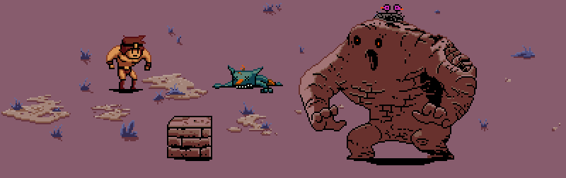

# Dem Creepers!

The player incarnates a barbarian that tries to survive against monsters coming un ever growing attack waves.  
To defend himself, the barbarian can throw axes in all directions, **changing** the corpses of fallen ennemies into improvised defenses to face future assaults more efficiently.

**Dem Creepers!** is powered by [Jaws](http://www.jawsjs.com/).

## The team

**Dem Creepers!** is developed by **H-Bomb**.

* Harlan Chomarat ([@Mister_Haru](https://twitter.com/Mister_Haru)), game designer
* Matthieu Godet ([@MatthieuGodet](https://twitter.com/MatthieuGodet)), animator
* [Paul Joannon](http://pauljoannon.com) ([@pauljoannon](https://twitter.com/pauljoannon)), developer
* Maxime Romain ([@Noojsan](https://twitter.com/Noojsan/)), composer